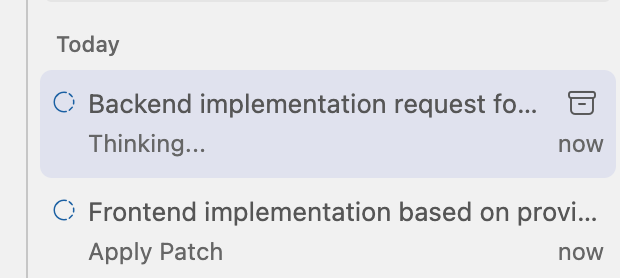
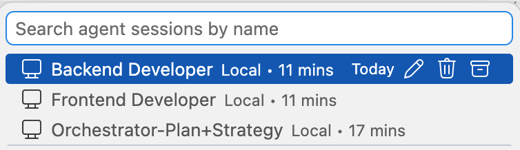
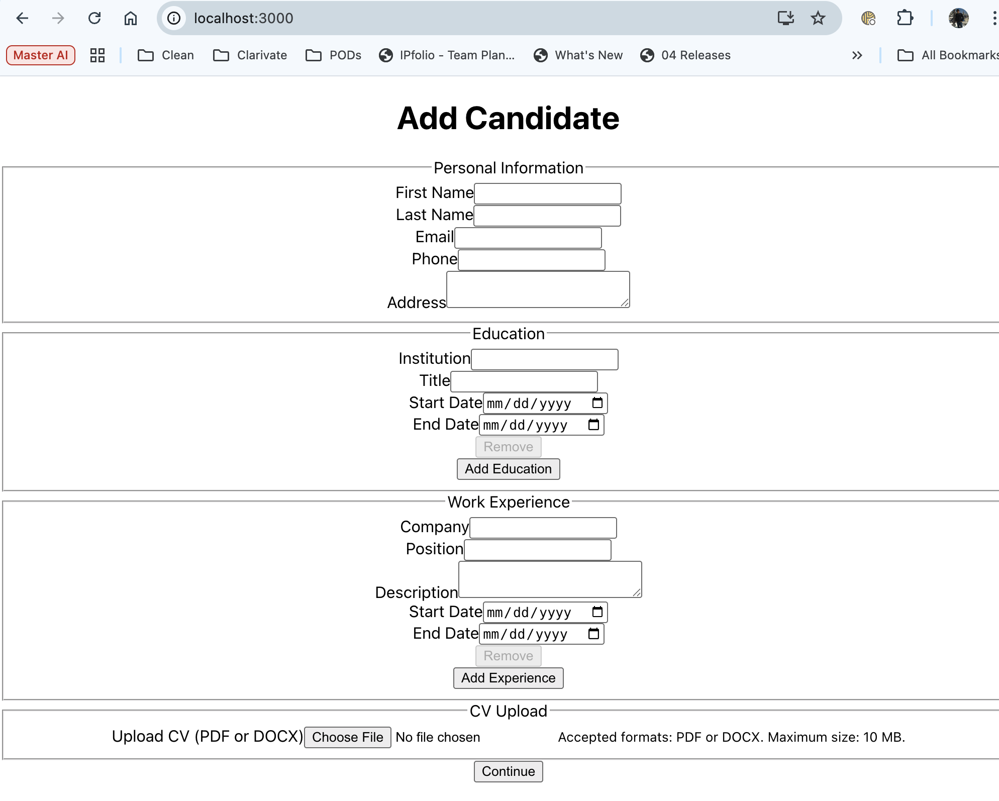
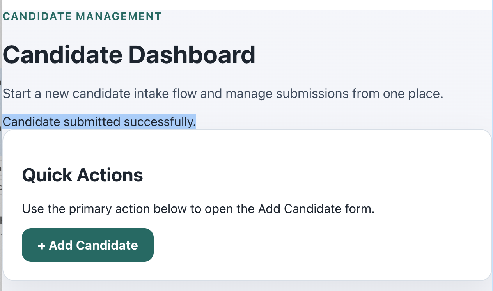
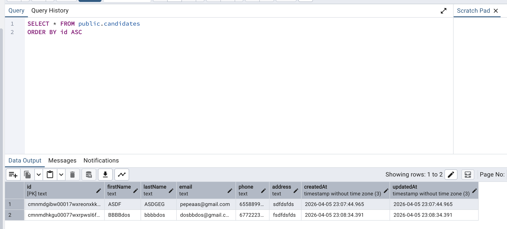
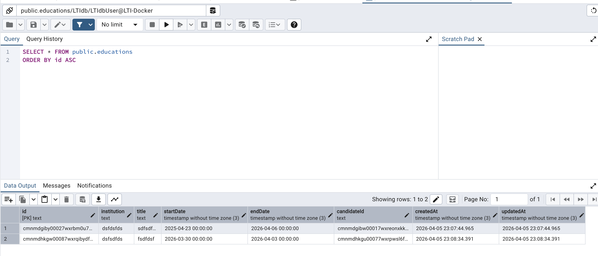
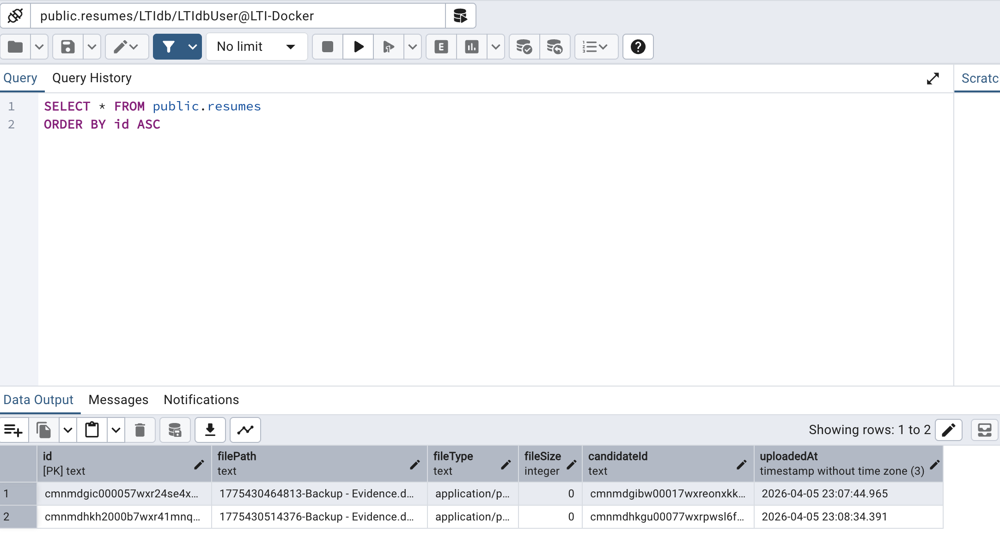
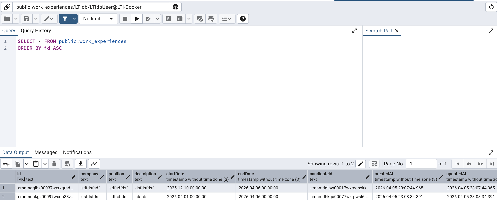

# Estrategia inicial
Dado que el ticket no es atómomico, hay que refinarlo desde el punto de vista de product, backend y frontend.
## US Enrichment
Basándome en el vídeo de Álvaro me ha parecido una idea genial tener un agente especializado en producto que sea capaz de enriquecer una US
  - [Enrich US](./prompts/enrich_us.md)

## Backend and Frontend Refinement
Tras esto voy a verificar que las tareas son suficientemente atómicas pidiendo a los agentes de frontend y backend que me creen un plan (refinement) para satisfacer los requerimientos funcionales y no funcionales, acceptance criteria, DoD.
  - [Frontend-Ticket Split](./prompts/frontend_ticket_split.md)
  - [Backend-Ticket Split](./prompts/backend_ticket_split.md)

## Plan
Con el split en tickets para backend y frontend detallando las tareas blocker de uno y otro con /plan pediré que teniendo en cuenta ambos tickets (dando contexto del ambos en ficheros Markdown) me genere un plan de implementación incluyendo validación manual, fases y memory banks:
  - [Implementation Plan](./prompts/implementation_plan.md)

## Implementation plan (meta-prompt)
Basandome en el plan de implementación definido preguntaré en el implementation approach (multi-agente, autopilot, etc), parecido al metaprompt que vimos de Álvaro:
  - [Implementation Strategy](./prompts/implementation_strategy.md)

## Meta-Prompting per Phase
Ahora usaré la estrategia de meta-prompt para que me de los prompts para cada una de las fases de manera que se ejecute en modo multi-agente en paralelo como se define en la estrategia:
### Phase 1 Meta-Prompt](./prompts/phase-1-meta-prompt.md)
  - Ejecuté ambos prompts (backend y frontend) como agentes especializados (en paralelo):
    
  - Aquí creó un checkpoint como le pedí.
    
  - También aquí renombré los Chat para no equivocarme de agente y tarea:
    
  - Tras la validación manual procedí con la siguiente fase.
### [Phase 2 Meta-Prompt](./prompts/phase-2-meta-prompt.md) 
  - Aquí no entregó una respuesta tan detallada, tuve que pedir que lo hiciera.
  - En esta versión ya tenemos algo más visual y funcional.
  
### [Phase 3 Meta-Prompt](./prompts/phase-3-meta-prompt.md)
  - Verificación final satisfactoria, sin errores.
  - La conversación en ambos agentes empezó a ser demasiado grande para manejar el context, GitHub Copilot decidió compactar.
### [Phase 4 Meta-Prompt](./prompts/phase-4-meta-prompt.md)
  - Durante la verificación de esta faseme di cuenta que no pudo ejecutar los Test de Frontend ni tampoco el browser accesibility verification debido a un CMD que se quedó bloqueado. Hice un Hard-kill del proceso y pedí que lo realizara de nuevo resultando en un error solventado.
### [Phase 5 Meta-Prompt](./prompts/phase-5-meta-prompt.md)
- En este punto verifiqué la funcionalidad de guardar el candidato pero en la consola de Javascript daba un error. Dí el contexto de lo que estaba probando así como el stacktrace de la consola del Browser. (CORS).
  - Tras resolver el problema verifiqué todo funcionaba incluido el guardado en DB:
  
  
  
  
  

# Commit history
El orden de los commits refleja el flujo seguido en este fichero así como la agrupación de ficheros añadidos / modificados.
